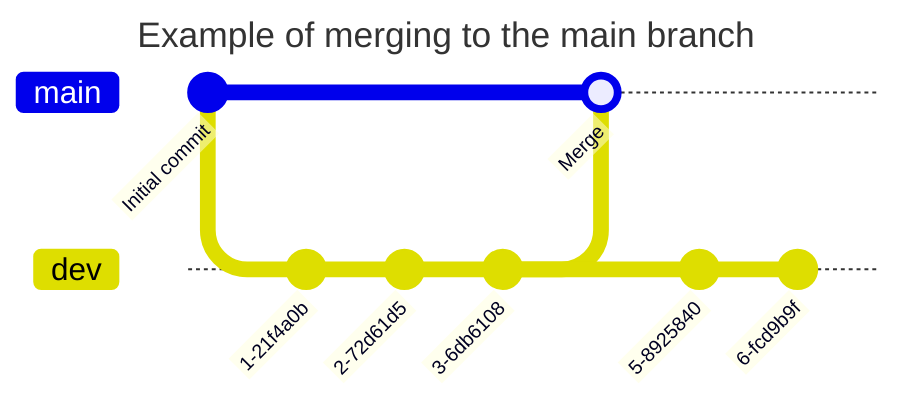

# Stunlock workflow

Stunlock is a proprietary (perhaps source-available upon release) web application developed in part of a university course. 

This document describes the contributing workflow of the project.

## Workflow

Developers are encouraged to freely merge changes upon the development branch, but larger changes to the main branch shall have prior agreement. 

Changes on the dev branch are more flexible, developers may use feature branches or directly push onto the dev branch. Feature branches shall be merged to the dev branch.

In the case of merge conflicts, developers are encouraged to rebase on private/local branches. On public feature branches developers shall use merge instead.

## Branches

### Main branch

Changes to the main branch engages the full CI/CD pipeline, which integrates the new changes to the production enviornment.

### Dev branch

Where all development happens. Developers push changes freely to this branch. Changes to the dev branch may engage a CI/CD pipeline to integrate changes to a development enviornment.