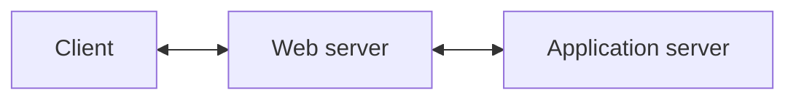

# Client

The client (website) is the frontend of the web application. The website is built with vanilla JS with Vite.js and Tailwind.

The Vite.js bin is served by a web server built with Express.js that also serves as a proxy to the backend. Having Express.js serving as a web server opens up several possibilities, including SSR, serving error pages, serving only authorized pages etc.

